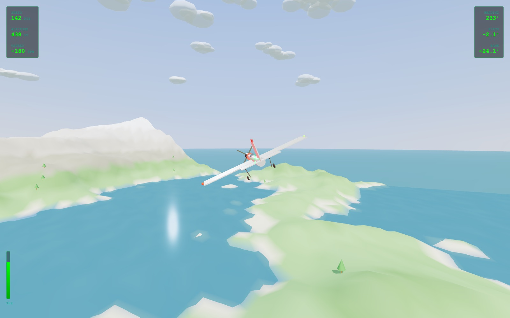

# Schappi Studios — website

Static site. No build step, no dependencies, no framework. Plain HTML, one
stylesheet, one script. Edit the `.html` files directly.

## Run it locally

    python3 -m http.server 8000

Then open <http://localhost:8000>. Use a server rather than double-clicking the
files — relative paths and the flight-sim iframe behave differently over
`file://`.

## Files

    index.html                   Home, served at /
    games/index.html             /games
    about/index.html             /about
    privacy/index.html           /privacy
    home/index.html              /home - a redirect to /, nothing else

    games/flight-sim/index.html   /games/flight-sim. Standalone, self-contained.
    games/god-sim/                /games/god-sim, built from ../god-sim (below).

    assets/css/site.css           Every visual decision on the site
    assets/js/site.js             Nav, playable embeds, video, lightbox, forms
    assets/img/                   favicon.svg, screenshots

Every page except the home page lives in a directory of its own and is called
`index.html`, so the URL is the folder name with no extension: `/games`, not
`/games.html`. Any static host serves it this way with no configuration.

Because the pages sit at different depths, **all internal links and asset paths
are root-relative** (`/assets/css/site.css`, `/games/`). A relative path would
resolve against the folder the page is in and break. The repo is
`lucasschappi.github.io`, a user site, so the site root really is `/`.

The header and footer are duplicated in each page rather than templated. There
are five real pages; a change to the nav is five edits. That is cheaper than
adding a build step.

## The theme

Plain and light on purpose. System font stack, white background, one blue
accent, modest heading sizes. **No web fonts are loaded** — the only external
request the whole site makes is the Fire Arcade link, and Three.js on the
flight-sim page.

All theming lives in the `:root` block at the top of `site.css`:

    --bg, --bg-2, --bg-3          backgrounds, lightest to darkest
    --text, --text-2, --text-3    text, strongest to faintest
    --border, --border-2          hairlines and stronger edges
    --accent, --accent-dark,      the blue, its hover state, its tint
    --accent-bg
    --wrap                        content width (1080px)
    --radius                      corner rounding (8px)

Change the accent in one place and the whole site follows. Don't hard-code
colours further down the file.

## The two kinds of blank

**`<!-- SLOT: ... -->`** — an empty region waiting for content (a screenshot, a
set of links). Invisible in the browser.

**`[...]`** — copy that hasn't been written. Renders
as a yellow highlight so you can spot it on the page. Delete the wrapping
`` when the real words go in. When no yellow remains, the page is done.

Still outstanding:

    about/       [one line summary]
    games/       [one line introducing the work]
                  [what Fire Arcade is and who it's for]
                  [what the player does]  ×2 (Turret Showdown, Sheep and Tree World)
                  [browser name], [what it does and why you built it], [download]
    index.html   [one line: what Fire Arcade is]
                  [one line: what the player does]  ×2
    privacy/     [last updated date]

### Writing a game one-liner

Say what the player *does*, in concrete verbs and real nouns, under about
fifteen words.

> Good: "Fly a light aircraft over procedurally generated mountains and coast."
> Dead: "An immersive journey of exploration and discovery."

Avoid *immersive, unique, crafted, experiences* and *we believe* — every studio
site uses them, so they carry no information.

## Game of the day

The home page features one game, chosen by the date rather than by a server:
`assets/js/site.js` counts whole days since the epoch and takes that modulo the
length of its `GAMES` list. Everyone opening the page on the same day sees the
same game, and it changes at local midnight.

The markup in `index.html` already contains a complete, working entry, so the
section is correct with JavaScript switched off; the script only ever swaps one
real entry for another. To add a game, add an object to `GAMES` and make sure
its image exists.

## Game of the week poll

Off by default. `POLL_ENDPOINT` at the top of the poll block in
`assets/js/site.js` is empty, so the section stays hidden; it also hides itself
if the endpoint stops answering, which means a missing or broken backend shows
nothing rather than an empty poll.

Turning it on is one line, once an endpoint exists. `docs/poll-api.md` has the
contract it expects and a Lambda that satisfies it.

## The playable embed

`games/index.html` embeds the flight sim without loading it up front. The markup:

    

      

        
        

          <a class="btn play-embed__start" href="/games/flight-sim/">Play in your browser</a>
          
Runs in the page — nothing to install.

        

      

      

        
...controls...

        

          <a class="btn btn--ghost btn--sm" href="/games/flight-sim/" data-fullscreen>Fullscreen</a>
          <a class="btn btn--ghost btn--sm" href="/games/flight-sim/">Open on its own</a>
        

      

    

Both controls are ordinary links to the standalone game. `site.js` intercepts
the click and builds an `<iframe>` instead — so a visitor who never plays
downloads nothing but the poster image, and a visitor whose JavaScript fails
still gets the game rather than a dead button. To add another playable game:
drop a self-contained HTML file in `games/`, copy the block, and change
`data-play`, the `href`s, the poster and the controls line.

The `?v=` on the stylesheet and script URLs is a cache-buster. Bump it when you
change `site.css` or `site.js` and a browser insists on an old copy.

### Rebuilding God Sim

`games/god-sim/` is compiled output, not source. The source lives in the
separate `god-sim` project. Vite defaults to absolute `/assets/...` paths, which
break in a subdirectory, so build with a relative base:

    cd ../god-sim
    ./node_modules/.bin/vite build --base=./ --outDir=/tmp/godsim --emptyOutDir
    rm -rf ../SchappiStudios/games/god-sim
    cp -R /tmp/godsim ../SchappiStudios/games/god-sim

Never edit anything under `games/god-sim/` by hand — the next build overwrites
it.

The sim needs keyboard focus, which an iframe only gets after a click. It
starts on click as well as on Space, so one click both focuses and launches it.

## Content rule

Only work Schappi Studios actually made goes on this site.

Fire Arcade hosts many games written by other people. Fire Arcade *itself* is
studio work and belongs here; the third-party games it hosts do not. Listing
them as studio output would be untrue, and advertising hosted copies of
commercial games invites takedown notices.

## Screenshots

Every `.card__art` and `.frame` still holding a `SLOT:` comment is a grey box.
Filling them in is the single biggest visual improvement left. Drop images in
`assets/img/` and replace the comment:

    

      
    

Roughly 16:10 for card art, 16:9 for `.frame`. Export around 1600px wide as
JPEG — these are decoration, not downloads.

## Forms

The newsletter form (`index.html`)
have an empty `action=""`. While it is empty, `site.js` intercepts the submit
and shows a note instead of navigating, so nothing silently vanishes.

To connect one, point `action` at a form provider (Formspree, Buttondown,
Netlify Forms) and set the method it asks for. **Write the privacy policy
before turning on the email form** — collecting addresses without one is not
something to leave until later.

## Deploying

Push to `main`. GitHub Pages serves the repo root; there is nothing to build.
Netlify, Vercel and Cloudflare Pages all work the same way if you ever move.

The URLs are extensionless because of the directory layout above, not because
of any host rewrite rule, so they survive a move between hosts unchanged.

## Accessibility notes worth not breaking

- Skip link is the first focusable element on every page.
- The current page carries `aria-current="page"` in the nav.
- The nav toggle keeps `aria-expanded` in sync.
- Every input has a visible `<label>` or an `aria-label`.
- Animation is disabled under `prefers-reduced-motion`.
- The mobile nav fades and scales rather than sliding in from off-screen. A
  fixed element translated off-canvas escapes `overflow-x: hidden` and gives
  phones a phantom horizontal scroll. Don't reintroduce `translateX` there.
